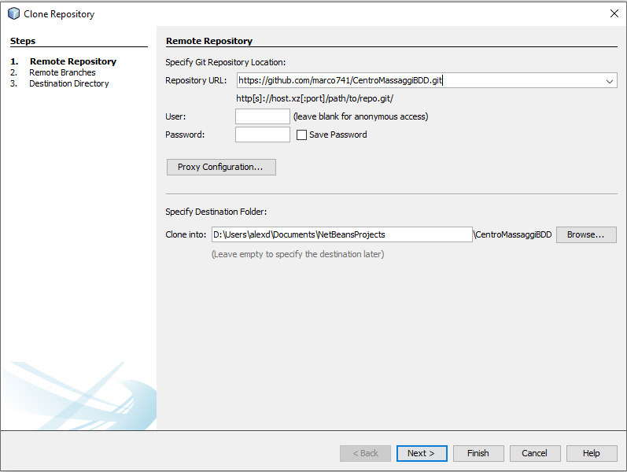
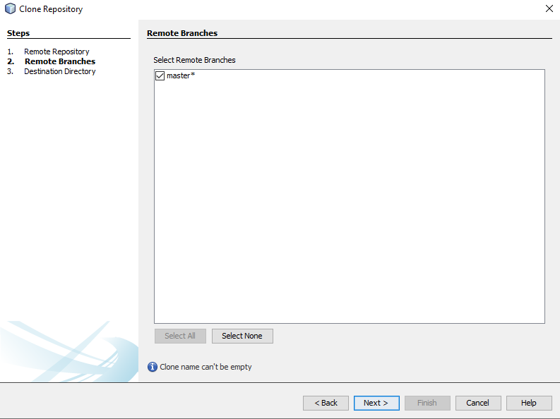
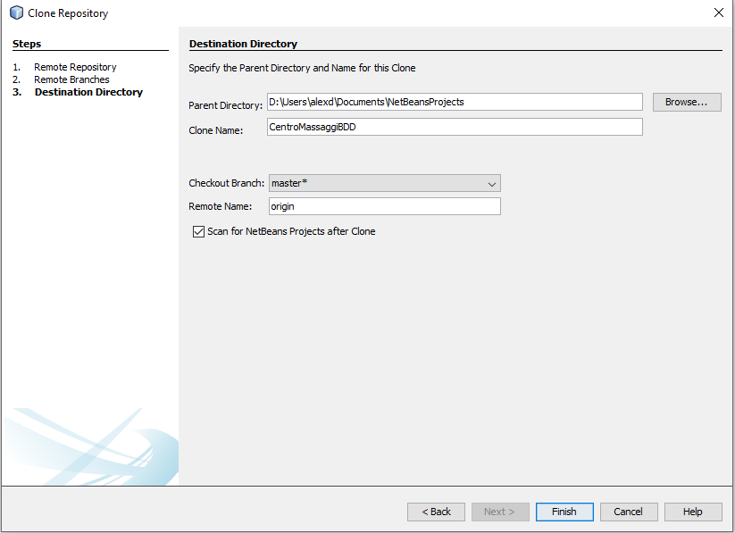
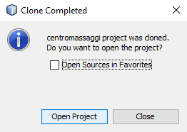
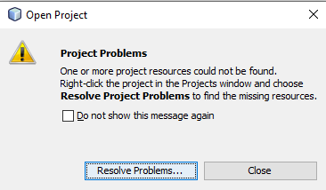
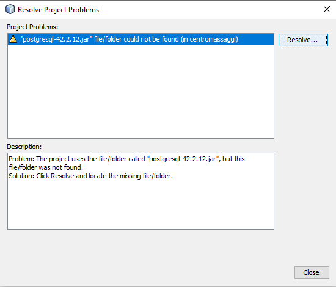
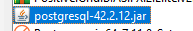
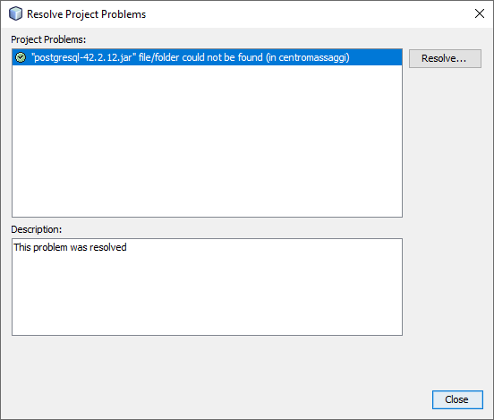
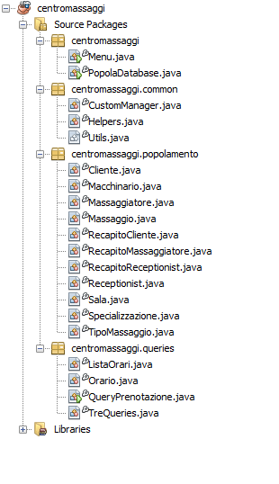

# Progetto centromassaggi

Repository pubblica per il progetto di basi di dati del gruppo 07 sulla realtà di un centro massaggi.

### Caro prof,

se sta visitando questa repository vuol probabilmente dire che sta apprezzando il nostro lavoro e ci fa molto piacere :).

## Installazione

Creare un database locale con PostgreSQL chiamato "centromassaggi".

Avviare lo script di creazione presente nel file nella root del progetto chiamato "scriptcreazione.sql".

Clonare il progetto direttamente su netbeans come mostrato di seguito

Cliccare su Team -> Git -> Clone...

Inserire il link di questa repository come di seguito.
NOTA: Non è necessario effettuare il login.

Cliccare su next.

Scegliere un percorso nel quale salvare il progetto di NetBeans o lasciare quello di default.
Cliccare su Finish.

Cliccare su Open Project.

Verrà mostrato un errore in quanto il collegamento al DriverManager non risulta valido.
Cliccare su Resolve Problems...

Poi ancora su Resolve...

Selezionare il Driver per Postgres tramite l'explorer e confermare.

A questo punto il problema dovrebbe essere risolto.
Cliccare su close.

## Source tree

Il source tree si presenta come segue.

Nel package principale "centromassaggi" sono presenti due file .java eseguibili che si interfacceranno con il database postgres.
Le configurazioni del database possono essere modificate nel file CustomManager.java in "centromassaggi.common".

Qui è possibile specificare il link di connessione a Postgres, l'utente e la password.

Per semplicità è sufficiente creare sulla macchina locale un database chiamato "centromassaggi" ed inizializzarlo con lo script che si trova nel file "scriptcreazione.sql" nella root di questa repository.

Successivamente è possibile eseguire il file PopolaDatabase.java per eseguire il popolamento o Menu.java per provare le query implementate.

Buon divertimento!

